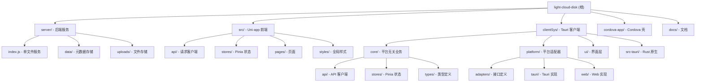

# CLAUDE.md

> 变更记录 (Changelog)
> - 2026-05-10 21:26:03: 全仓扫描更新，刷新模块文档，更新 Mermaid 结构图和覆盖率报告

## 项目愿景

轻量云盘系统 (Light Cloud Disk) 是一个跨平台文件管理云盘，支持 Web、Android、iOS、微信小程序、桌面端等多端运行。核心设计理念是**轻量化**：极简架构、单文件后端、无用户体系（API Key 认证）、JSON 文件存储元数据。

## 架构总览

项目包含三个独立的前端客户端和一个共享后端：

```
light-cloud-disk/
├── server/          # 后端服务 (Node.js + Express, v1.0.0)
├── src/             # Uni-app 前端 (v2.0.0, H5/Android/iOS/小程序)
├── clientSys/       # Tauri 2.0 客户端 (v3.0.0, 桌面端/Android/iOS/Web)
├── cordova-app/     # Cordova 打包壳 (v1.0.0, 构建产物)
├── docs/            # 项目文档
└── .spec-workflow/  # 规范工作流模板
```

**技术栈一览：**

| 层级 | 技术 |
|------|------|
| 后端 | Node.js + Express + Multer + JSON 文件存储 |
| Uni-app 前端 | Vue 3 + Pinia + TypeScript + Uni-app + uview-plus |
| Tauri 客户端 | Vue 3 + Pinia + TypeScript + Vue Router + Tauri 2.0 (Rust) |
| 构建工具 | Vite (CLI) / Vue CLI (HBuilderX) |
| 样式 | SCSS，全局变量 + mixins 自动注入，CSS 变量运行时主题切换 |
| 部署 | Nginx 反向代理 + PM2 进程管理 |

## 模块结构图



## 模块索引

| 模块 | 路径 | 语言/框架 | 版本 | 职责 |
|------|------|-----------|------|------|
| **server** | `server/` | Node.js + Express | 1.0.0 | 后端 API 服务，文件上传/下载/删除/分享 |
| **src** | `src/` | Uni-app + Vue 3 + Pinia | 2.0.0 | 跨平台前端（H5/Android/iOS/小程序） |
| **clientSys** | `clientSys/` | Tauri 2.0 + Vue 3 + Rust | 3.0.0 | 桌面端/移动端原生客户端 |
| **cordova-app** | `cordova-app/` | Cordova | 1.0.0 | Android 打包壳（构建产物） |
| **docs** | `docs/` | Markdown | - | API/需求/架构/部署文档 |

## 运行与开发

### 后端服务

```bash
cd server
npm install
npm start          # 生产环境 (默认端口 3000)
npm run dev        # 开发模式 (nodemon 热重载)
```

配置优先级：`.env` > `config.json` > 默认值。生产环境端口为 12140。

### Uni-app 前端

```bash
cd src
npm install
npm run dev:h5           # H5 开发 (localhost:5173, 代理 /api -> localhost:3000)
npm run dev:app-android  # Android 开发
npm run dev:mp-weixin    # 微信小程序开发
npm run build:h5         # H5 生产构建
npm run lint             # ESLint 检查修复
npm run type-check       # TypeScript 类型检查
```

### Tauri 客户端

```bash
cd clientSys
npm install
npm run dev         # Vite 开发服务器 (localhost:1420)
npm run dev:tauri   # Tauri 桌面端开发
npm run dev:android # Tauri Android 开发
npm run build:tauri # Tauri 桌面端构建
npm run lint        # ESLint 检查修复
```

### 部署

```bash
bash deploy-to-server.sh   # 云服务器部署
pm2 start index.js --name light-cloud-disk-server  # PM2 管理
```

Nginx 配置参考 `nginx-syncqclous.conf`，前端路径 `/syncqclous`，API 路径 `/syncqclous/api/`。

## 测试策略

当前项目**无自动化测试**。建议优先为以下模块添加测试：
- server：API 端点的集成测试（supertest）
- clientSys/core：核心 stores 和 API 客户端的单元测试（Vitest）
- src/stores：Pinia stores 的单元测试

## 编码规范

**通用规范：**
- 优先 `const`，禁止 `var`
- 生产环境禁止 `console`/`debugger`

**Uni-app 前端 (src/)：**
- ESLint: Vue 3 + TypeScript 规则
- Prettier: 无分号、单引号、2 空格缩进、100 字符行宽、无尾逗号
- TypeScript: 宽松配置（允许 `any`、允许非空断言）

**Tauri 客户端 (clientSys/)：**
- ESLint: Vue 3 + TypeScript 规则（与 src 类似）
- Prettier: 同 src
- TypeScript: 严格模式（`strict: true`）
- 路径别名: `@` -> `src/`, `@core` -> `src/core/`, `@platform` -> `src/platform/`, `@ui` -> `src/ui/`

**后端 (server/)：**
- 无 lint 配置，遵循 Node.js 标准实践

## 关键设计模式

1. **平台适配器模式** (clientSys): 核心业务逻辑通过 `PlatformAdapters` 接口抽象平台差异，Tauri/Web 各自实现
2. **工厂函数 Store** (clientSys): Pinia stores 使用工厂函数创建，通过参数注入依赖（StorageAdapter、ApiClient）
3. **配置双源**: `config.json`（根目录）和 `.env`（server 目录），config.json 同时供前后端使用
4. **跨平台条件编译** (src): `// #ifdef H5` / `// #endif` 处理平台差异
5. **双布局策略**: 移动端/桌面端各自有完整 HTML 结构，CSS 响应式切换（768px 分界）
6. **主题系统**: SCSS 变量 + CSS 变量双层架构，`var(--xxx, fallback)` 实现运行时主题切换
7. **构建系统双轨制** (src): Vite (CLI) 和 Vue CLI (HBuilderX) 并存

## AI 使用指引

- 修改后端 API 时，同步更新 `docs/api.md` 和前端的 `api/types.ts`
- 修改 clientSys 的适配器接口时，需同时更新 Tauri 和 Web 两套实现
- clientSys 的 stores 使用工厂函数模式，不能直接 `defineStore`，需通过 `createXxxStore(dependency)` 创建
- 样式修改需同时更新 `_variables.scss` 和 CSS 变量（App.vue 中的 `:root` 和 `[data-theme="dark"]`）
- `config.json` 包含敏感信息，已在 `.gitignore` 中排除
- H5 开发代理已配置：`/api` -> `http://localhost:3000`（src）/ `http://117.72.196.45`（clientSys）
- 生产环境部署端口为 12140（非默认 3000）

## 文档索引

| 文档 | 路径 | 说明 |
|------|------|------|
| API 接口文档 | `docs/api.md` | 后端 API 详细说明 |
| 需求文档 | `docs/requirements.md` | 产品功能需求 |
| 架构文档 | `docs/architecture.md` | 系统架构设计 |
| 部署文档 | `docs/deployment.md` | 部署和运维指南 |
| 代码维基 | `CODE_WIKI.md` | 项目代码维基 |
| server 模块文档 | `server/CLAUDE.md` | 后端服务详细文档 |
| src 模块文档 | `src/CLAUDE.md` | Uni-app 前端详细文档 |
| clientSys 模块文档 | `clientSys/CLAUDE.md` | Tauri 客户端详细文档 |

## 变更记录 (Changelog)

| 日期 | 变更 |
|------|------|
| 2026-05-10 21:26:03 | 全仓扫描更新：刷新模块文档，更新覆盖率报告，确认无自动化测试 |
| 2026-05-10 | 初始化项目 AI 上下文：生成根/模块 CLAUDE.md，创建 .claude/index.json |
